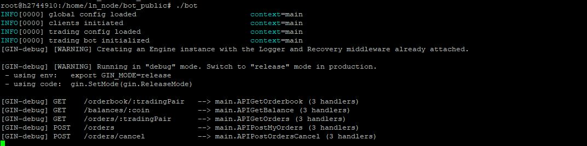
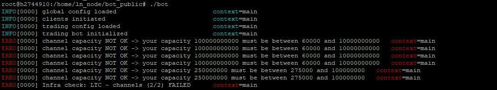
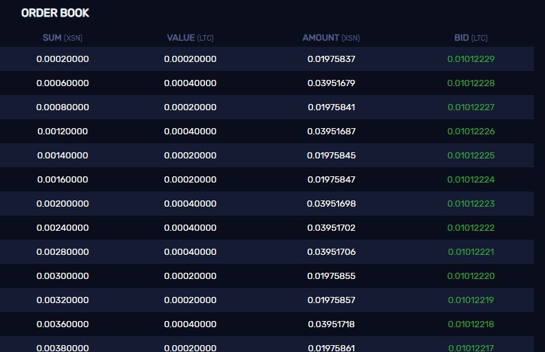
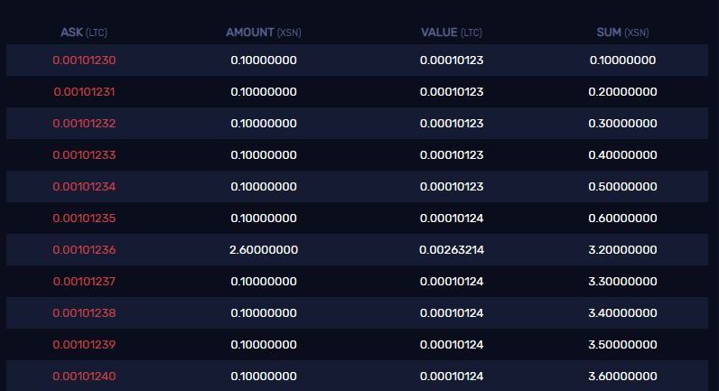
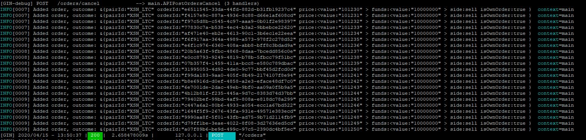

## Simple DEX Client installation

The following installation will make sure that you can test the client for the DexAPI. It has some mandatory infrastructure checks and allows you to interact with the client via a http server.
It's not an actual bot implementation, more like the ground work to get started.

**Mandatory:** check out [infrastructure guide](infrastructure.md) to get your VM installed with the required components. 

#### Install

Get the release from public repo and get started.

`cd ~/bot`

`wget https://github.com/cwntr/go-dex-client/releases/download/v1.0.0/bot.zip`

`unzip bot.zip`

`rm bot.zip`

`chmod +x bot`

`chmod -R +x examples`

#### Copy tls to local bot path

Copy your existing certificates from .lnd_* folders to the `bot/certs` path that it is authorized to perform the actions.

`cp ~/.lnd_xsn/tls.cert ~/bot/certs/xsn.cert`

`cp ~/.lnd_ltc/tls.cert ~/bot/certs/ltc.cert`

`cp ~/.lnd_btc/tls.cert ~/bot/certs/btc.cert`


##### Configure the bot

Take the default config and adapt your paths accordingly if needed. This `cfg.json` must be in the `~/bot` directory.

`touch cfg.json`

`nano cfg.json` -default:

```
{
  "botCfg": {
    "host":"localhost",
    "port":9999,
    "lnCLIPath": "/home/ubuntu/lnds/lncli",
    "jobInterval": "5s",
    "logLevel": "debug",
    "orderLimit": 10000
  },
  "lssdConfig": {
    "host": "",
    "port": 50051,
    "timeout": "500s"
  },
  "xsnLNDConfig": {
    "lndDir": "/home/ubuntu/.lnd_xsn/",
    "certPath":"certs/xsn.cert",
    "host": "localhost",
    "port": 10003,
    "hubPeers": [
      {"remoteKey": "0396ca2f7cec03d3d179464acd57b4e6eabebb5f201705fa56e83363e3ccc622bb", "address": "134.209.164.91:11384"},
      {"remoteKey": "03bc3a97ffad197796fc2ea99fc63131b2fd6158992f174860c696af9f215b5cf1", "address": "134.209.164.91:21384"}
    ]
  },
  "ltcLNDConfig": {
    "lndDir":"/home/ubuntu/.lnd_ltc/",
    "certPath":"certs/ltc.cert",
    "host": "localhost",
    "port": 10001,
    "hubPeers": [
      {"remoteKey": "0375e7d882b442785aa697d57c3ed3aef523eb2743193389bd205f9ae0c609e6f3", "address": "134.209.164.91:11002"},
      {"remoteKey": "0211eeda84950d7078aa62383c7b91def5cf6c5bb52d209a324cda0482dbfbe4d2", "address": "134.209.164.91:21002"}
    ]
  },
  "btcLNDConfig": {
    "lndDir":"/home/ubuntu/.lnd_btc/",
    "certPath":"certs/btc.cert",
    "host": "localhost",
    "port": 10002,
    "hubPeers" : [
      {"remoteKey": "03757b80302c8dfe38a127c252700ec3052e5168a7ec6ba183cdab2ac7adad3910", "address":"134.209.164.91:11000"},
      {"remoteKey": "02bfe54c7b2ce6f737f0074062a2f2aaf855f81741474c05fd4836a33595960e18", "address":"134.209.164.91:21000"}
    ]
  }
}
```

##### Start the mandatory services that the client can operate (if you not done yet):

1. `sudo systemctl start lnd_xsn`

2. `sudo systemctl start lnd_ltc`

3. `sudo systemctl start lnd_btc`

4. `sudo systemctl start lssd`

From here on I would suggest to try the bot by starting it manually to check whether everything is setup correctly. You can do that by:

`cd ~/bot`

`./bot`

This should give you default info logs like the following:



If it looks like the following it means your infrastructure is not ready yet and you need to adjust the channels / Stakenet Hub peers:




## Try out examples

Once everything is finally setup, try it out! Have a look at [examples folder](../examples) which has a cURL collection of requests you could fire against your active client. It is also part of the release and should be next to your `bot` binary.

So, make sure the bot is running in a different terminal and execute the following examples.

### 1.) Get current orderbooks

`cd ~/bot/examples`

`./get_full_orderbook.sh`

Which basically contains of:
```
# get current orderbook by trading pair
curl http://localhost:9999/orderbook/<trading_pair>
```

Which will output you all orders from orderbook (including your own)

### 2.) Get current LND balance

`cd ~/bot/examples`

`./get_my_balances.sh`

Which basically contains of:
```
# Check your LND wallet balance
curl http://localhost:9999/balances/<currency>
```

### 3.) Place a series of orders

This should not be done directly without checking the current orderbook. Since there might be already active orders / bots are running, it could be hard to track the outcome.

**Example for XSN_LTC**

Orderbook link: [XSN_LTC](https://orderbook.stakenet.io/XSN_LTC)
 

```
# XSN_LTC place 20 SELL orders with fixed quantity (funding of 0.1 XSN) with an iterative price increase of 1 sat
# single means -> only one order placed, no follow up logic
curl -X POST \
  http://localhost:9999/orders \
  -H 'content-type: application/json' \
  -d '[{
    "side": "sell",
    "tradingPair": "XSN_LTC",
    "priceRangeStart": 101230,
    "priceRangeEnd": 101250,
    "priceRangeStepSize": 1,
    "fixedFunding": 10000000,
    "type": "single"
}]'

# XSN_LTC place 14 BUY orders with fixed quantity (funding of 0.0002 LTC) with an iterative price increase of 1 sat
# IMPORTANT: buy orders need to have the funds converted to their currency -> in this case its LTC
# single means -> only one order placed, no follow up logic
curl -X POST \
  http://localhost:9999/orders \
  -H 'content-type: application/json' \
  -d '[{
    "side": "buy",
    "tradingPair": "XSN_LTC",
    "priceRangeStart": 101215,
    "priceRangeEnd": 101229,
    "priceRangeStepSize": 1,
    "fixedFunding": 20000,
    "type": "single"
}]'
```

You could change the price ranges based on the current orderbook's market price, that you can directly see on top of orderbook if your orders are placed.
In this example the market price was `101230 XSN sats`, placing orders:
 - buying orders from price `101215, 101216, [..],101229` 
   - 
 - selling orders from price `101230,101231, [..],101250`
   - 
 
 
Simply modify these values for the price start / end
```
"priceRangeStart": 101230,
"priceRangeEnd": 101250,
```
and maybe the `fixedFunding` if you want to adjust the quantity of coins used.

execute the series by: 

`./place_order_series.sh`

If the orders are not directly swapped by a peer and they remain in the orderbook, you will get a unique orderID associated with your new placed order. Like shown from the logs:




### 4.) Get my active orders 

`~/bot/examples`

`./get_my_active_orders.sh`

Which basically contains of:
```
# Get active placed orders by trading_pair
curl http://localhost:9999/orders/<trading-pair>
```

#### 5.) Cancel active orders

Here you can either cancel a specific order by its orderID, or you simply cancel all active orders for a trading-pair.

`~/bot/examples`

`./cancel_all_orders.sh`

Which basically contains of:
```
curl -X POST http://localhost:9999/orders/cancel \
  -d '{
	"cancelTradingPairs": [
		{
		    "tradingPair": "XSN_LTC",   #mandatory
		    "orderIds": ["7a5f862c-9651-472f-aa4f-ac91c221a0c6"], #optional
		    "deleteAll": true #optional
		}
	]
}'
```
Whereas either one of the optional properties must be set.


## Let bot run in background
Once you verified steps above work, you can enable the the systemd bot and leave it running in the background.
 
#### starting the bot 
`sudo systemctl start bot`

#### stopping bot
`sudo systemctl stop bot`

#### if your orders are messed up / you want to terminate all

Simply shutdown the LSSD:

`sudo systemctl stop lssd`

Beware: upon every restart of the LSSD, all your active orders will be gone.

---

If you find this page any useful, feel free to spare some coin:

**XSN:** XfiBSgdNJSVWsfZzKFa1HrcU8WgFCCUXGn

**ETH:** 0x28260E316Fa2491Af0005b7dF0085073B844B97b
