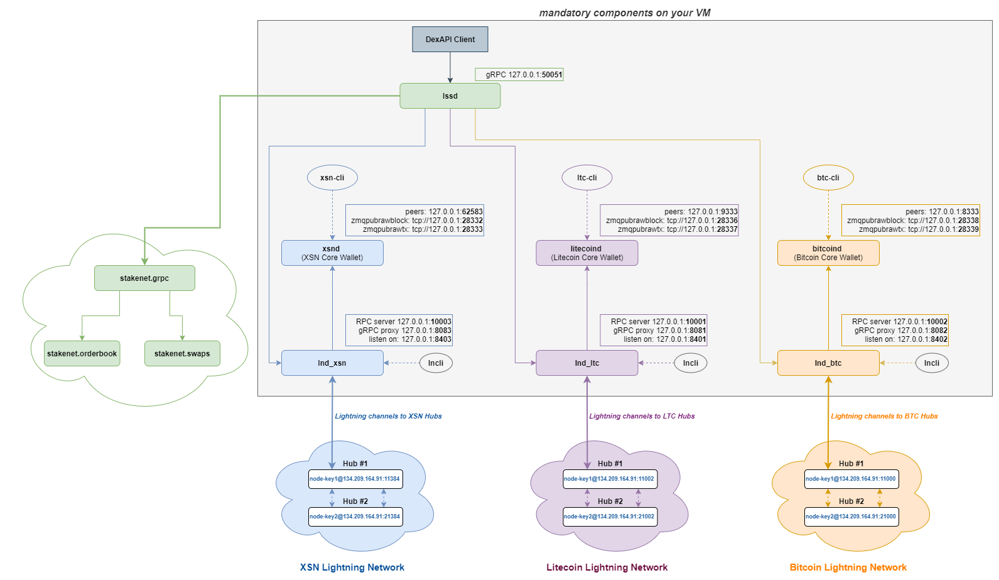

# Installation guide to run a DexAPI client on server 

In order to get the client running, you need to install some mandatory components. This guide will follow you through the full installation process with step by step commands to be executed.

VM requirements:

| Minimum  | Recommended |
| ------------- | ------------- |
| 4x vCPUs  | 8x vCPUs |
| 8 GB of RAM | 16 GB of RAM  |
| 500 GB HDD | 600+ GB HDD |
 
to get the components (fully synchronized BTC, LTC and XSN chains and 3x Lightning Network Daemon) running.

So log on to your Ubuntu VM and **[get started](guide_1_prerequisites.md)** with the installation guide split into 6 parts.

### Components Overview

---

If you find this page any useful, feel free to spare some coin:

**XSN:** XfiBSgdNJSVWsfZzKFa1HrcU8WgFCCUXGn

**ETH:** 0x28260E316Fa2491Af0005b7dF0085073B844B97b