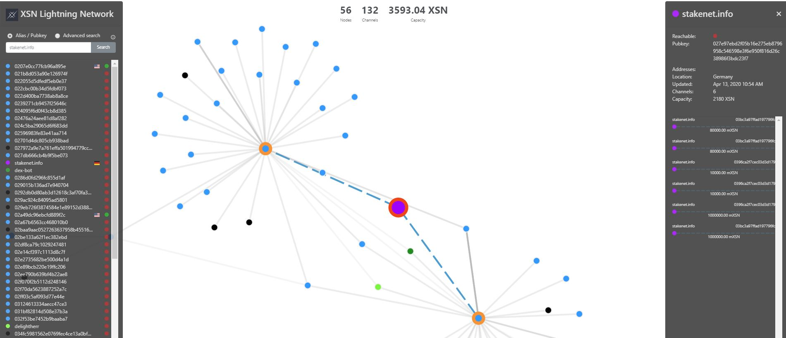

# Guide #6 - Dex Clients

[< back to Guide 5 - Lightning Channels](guide_5_lightning_channels.md)

Congratulations, you just setup all mandatory things to get to work with the Stakenet DexAPI. 
What next is to run a client that implements this API.
You could:
  - run a community go client -> [go-dex-client](https://github.com/cwntr/go-dex-client/blob/master/infrastructure/bot.md)
  - run the official scala trading client [scala implementation from X9](https://github.com/X9Developers/DexAPI/tree/master/trading-bot)
  - build your own client by implementing the API [releases](https://github.com/X9Developers/DexAPI/releases) -> `lssd.zip` which wraps 
    `/usr/include/lssdrpc.proto` 

## Extra: LND config

Current XSN [Lightning Network Explorer](https://ln.stakenet.info/):

You can give your Lightning nodes a name (alias) and an unique color to easier find your node in network explorers.
You can do that by modifying the respective `lnd.conf` from the `.lnd_*` directory and `sudo systemctl stop lnd_xsn` & `sudo systemctl start lnd_xsn` start your LND node.

```
alias=stakenet.info
color=#9d03fc
```

For example with this alias and color the Lightning Node will look like that:



All set? Check out the current active orders and feel free to participate: [DEX Orderbook](https://orderbook.stakenet.io/XSN_BTC)


---

If you find this page any useful, feel free to spare some coin:

**XSN:** XfiBSgdNJSVWsfZzKFa1HrcU8WgFCCUXGn

**ETH:** 0x28260E316Fa2491Af0005b7dF0085073B844B97b
